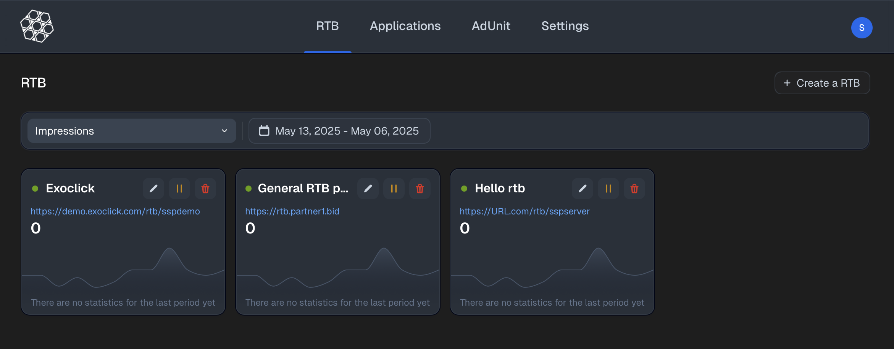
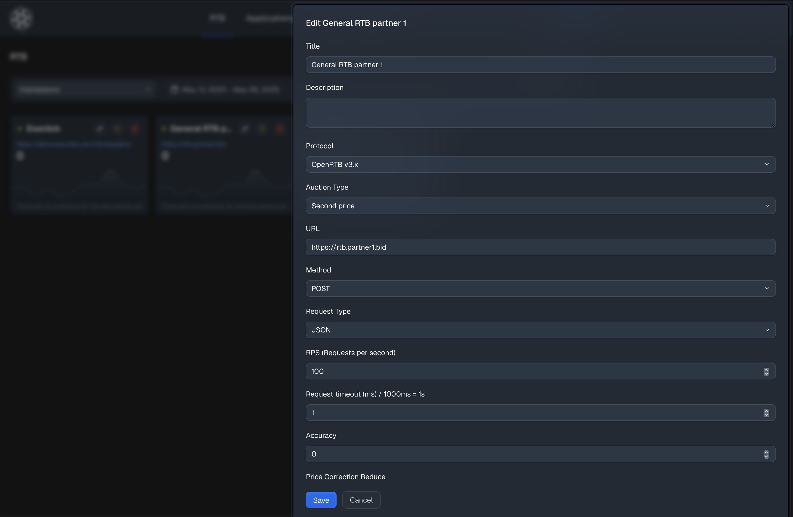

We’re excited to announce that development is underway on the **Control Panel for Open SSP Server** — a powerful interface for managing the key components of your advertising infrastructure.

### What’s Available Now

The **basic version of the control panel** already allows management of critical elements in your SSP stack:

- 🛰 **RTB Sources** — configure and manage real-time bidding endpoints  
- 🌍 **Websites** — manage publisher sites and associated metadata  
- 🎯 **Ad Spots** — define and edit placement rules and formats  
- ⚙️ **System Settings** — set core options for your traffic and logic handling

This foundational layer enables essential operations and integration without needing direct access to APIs or databases.

### What We’re Working On

Our next goals are focused on improving usability and expanding functionality:

- 🚦 **Advanced Traffic Routing** — build smart rules to direct traffic between partners  
- 📊 **Statistics & Reporting** — get insights into request flow and monetization  
- 🧩 **Better Form Structures** — simplified and dynamic UI/UX for data input and editing  
- 🛠 **Extended Entity Support** — support for additional SSP components and targeting layers

---

We are committed to building an intuitive, reliable, and developer-friendly interface to help teams get the most out of their Open SSP infrastructure.

Stay tuned — more updates are coming soon.
